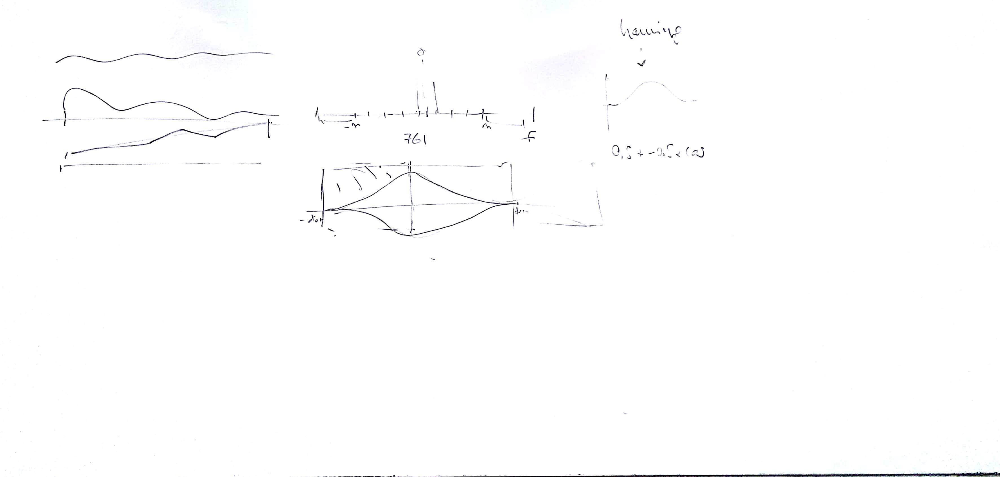
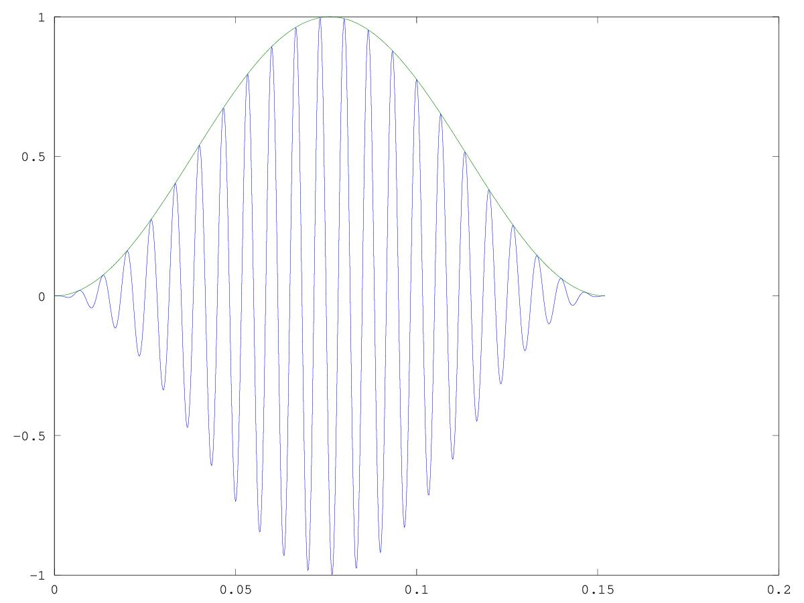
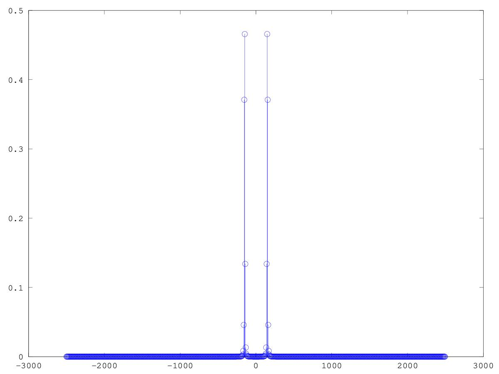
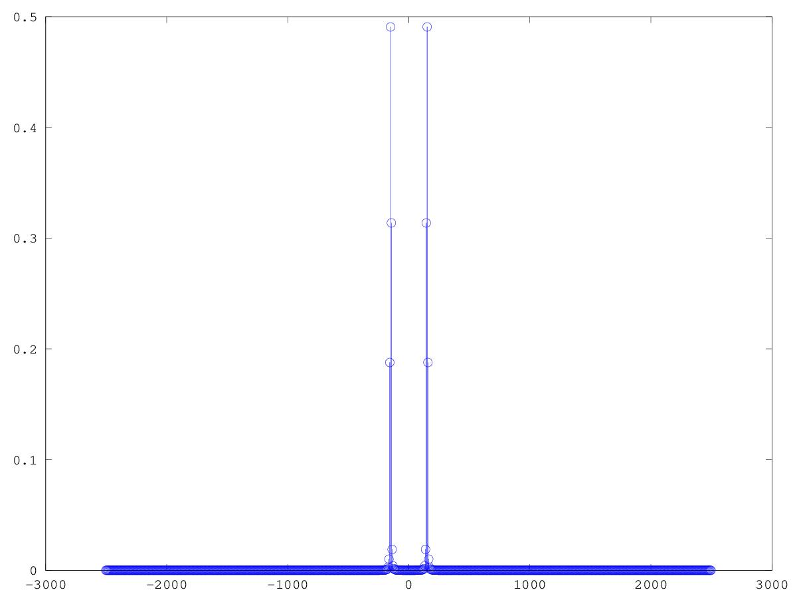
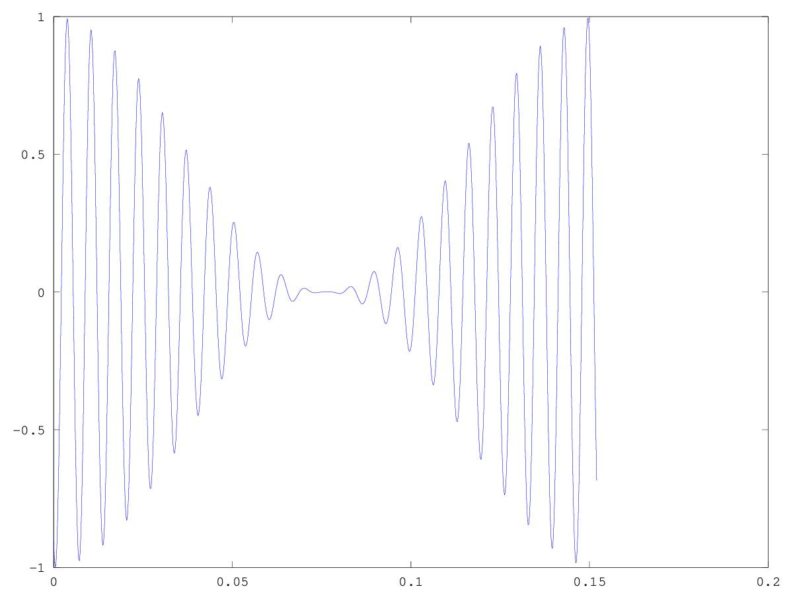
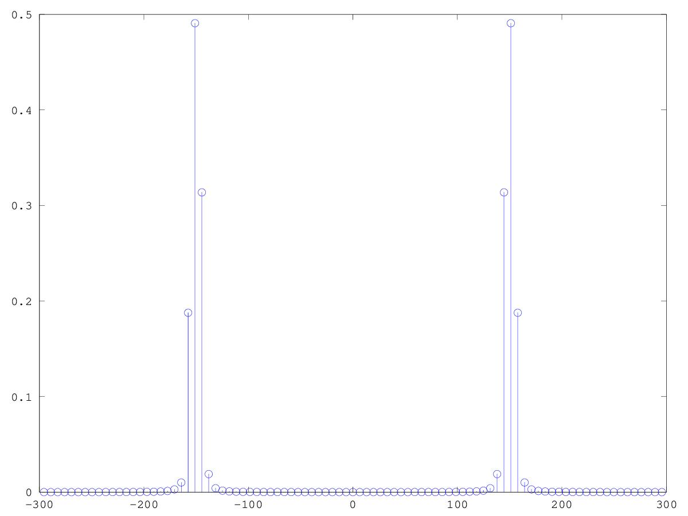

# CSEDSM II - Lezione del 5 dicembre 2018

## Argomenti

* Ricostruzione degli sms-tools con `matlab`/`octave`:
  * windowing
  * zero-phase windowing

## Lavagne



## Esempi `matlab`/`octave`:

[dft su una cosinusoide finestrata con finestra di Von Hann](./DFT_ZP1.m)


```matlab
close all
clear all

fc = 5000; 
pc = 1/fc;

dur = 0.5;

T = [0: pc: dur - pc];

amp = 1;
f = 150;
w = 2*pi*f;

y0 = amp*cos(w*T);

wsize = 761;
bsize = fc / wsize;
nq = fc/2;

F = [- nq: bsize: nq - bsize]; 

% Window Hanning

hf = fc / wsize;
hw = hf * 2 * pi;
h = 0.5 + (- 0.5*cos(hw * T(1:wsize)));

hy0 = y0(1:wsize).*h;

figure(1)
plot(T(1:wsize), hy0, T(1:wsize), h);

DFT = zeros(1, wsize);

for k = 1:length(F)
wa = F(k) * 2 * pi;
a = e.**(-i * wa * T(1:wsize));
ay = a.*hy0;
DFT(k) = sum(ay);
end

mDFT = (abs(DFT) / wsize) * 2; %si raddopia la magnitude per compensare la finestra di hanning 

figure(2)
stem(F, mDFT); 
```

Questo script produce i plot seguenti:






[dft su una cosinusoide finestrata con finestra di Von Hann](./DFT_ZP2.m)


```matlab
close all
clear all

fc = 5000; 
pc = 1/fc;

dur = 0.5;

T = [0: pc: dur - pc];

amp = 1;
f = 150;
w = 2*pi*f;

y0 = amp*cos(w*T);

wsize = 761;
bsize = fc / wsize;
nq = fc/2;

F = [-nq - (bsize/2) : bsize: nq - (bsize/2)]; 

% Window Hanning

hf = fc / wsize;
hw = hf * 2 * pi;
h = 0.5 + (- 0.5*cos(hw * T(1:wsize)));

hy0 = y0(1:wsize).*h;

figure(1)
plot(T(1:wsize), hy0, T(1:wsize), h);

DFT = zeros(1, wsize);

for k = 1:length(F)
wa = F(k) * 2 * pi;
a = e.**(-i * wa * T(1:wsize));
ay = a.*hy0;
DFT(k) = sum(ay);
end

mDFT = (abs(DFT) / wsize) * 2; %si raddopia la magnitude per compensare la finestra di hanning 

figure(2)
stem(F, mDFT); 
```

Questo script produce i plot seguenti:





[dft su una cosinusoide finestrata con finestra di Von Hann e zero-phase windowning](./DFT_ZP2.m)


```matlab
close all
clear all

fc = 5000; 
pc = 1/fc;

dur = 0.5;

T = [0: pc: dur - pc];

amp = 1;
f = 150;
w = 2*pi*f;

y0 = amp*cos(w*T);

wsize = 761;
bsize = fc / wsize;
nq = fc/2;

F = [-nq - (bsize/2) : bsize: nq - (bsize/2)]; 

% Window Hanning

hf = fc / wsize;
hw = hf * 2 * pi;
h = 0.5 + (- 0.5*cos(hw * T(1:wsize)));

hy0 = y0(1:wsize).*h;
hy0s = zeros(1, length(hy0));
hy0s(1: floor(wsize/2)) = hy0(ceil(wsize/2)+1:end);
hy0s((ceil(wsize/2))+1 : end) = hy0(1: floor(wsize/2));

figure(1)
plot(T(1:wsize), hy0s);

DFT = zeros(1, wsize);

for k = 1:length(F)
wa = F(k) * 2 * pi;
a = e.**(-i * wa * T(1:wsize));
ay = a.*hy0;
DFT(k) = sum(ay);
end

mDFT = (abs(DFT) / wsize) * 2; %si raddopia la magnitude per compensare la finestra di hanning 

figure(2)
stem(F, mDFT); 
axis([-300 300]);
```

Questo script produce i plot seguenti:





