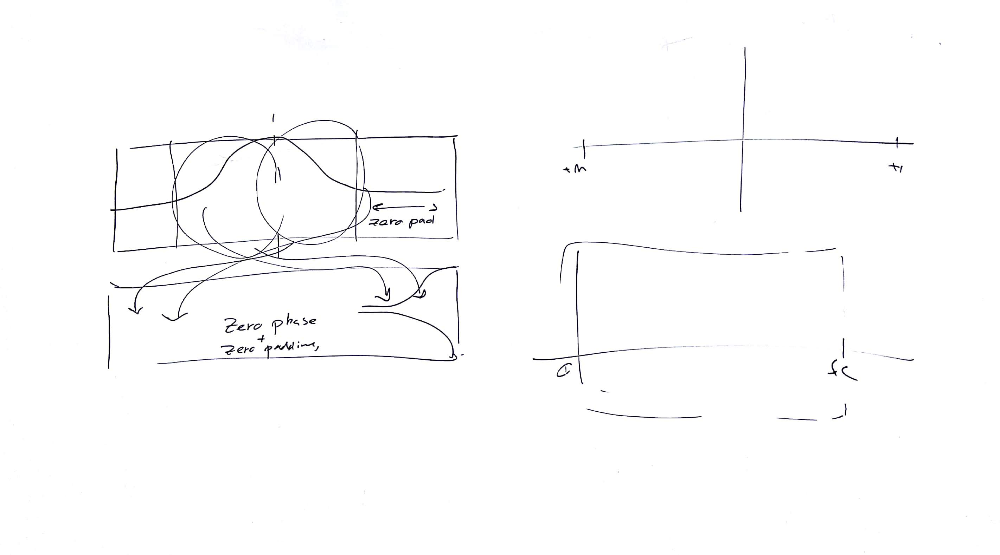
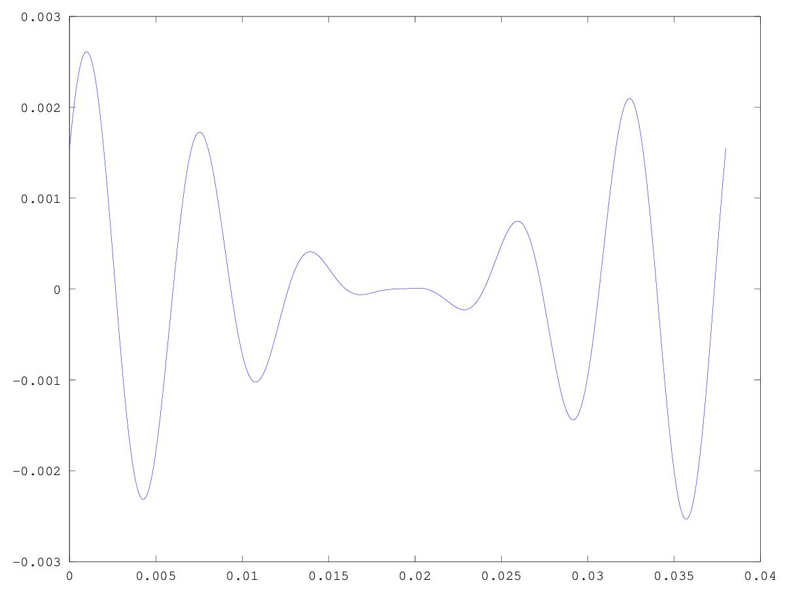
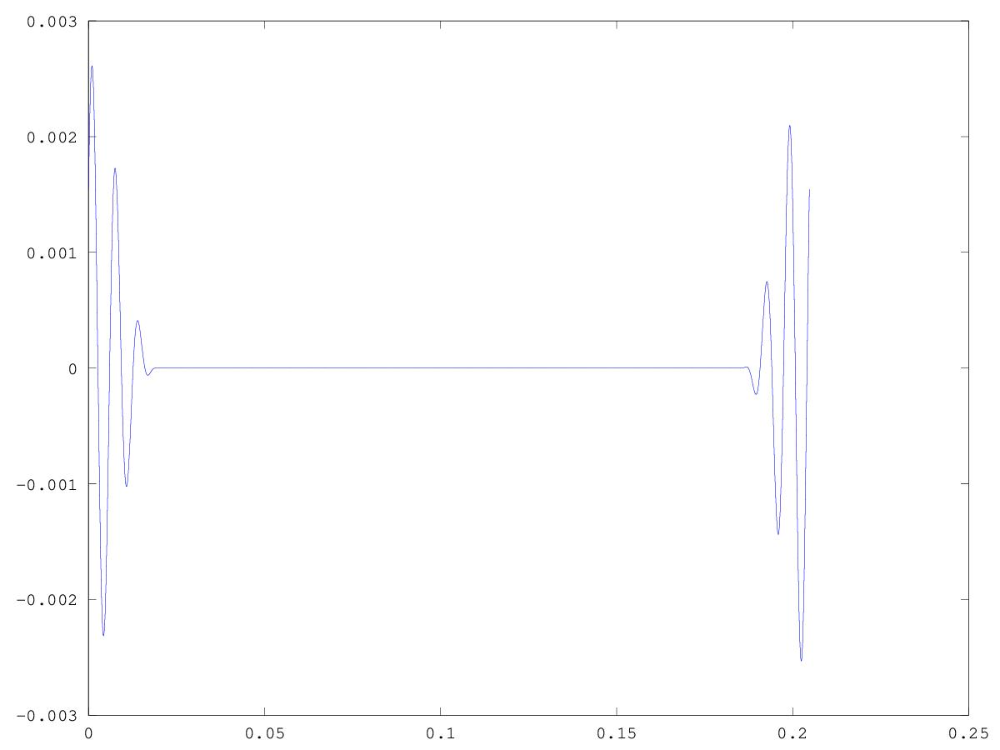

# CSEDSM II - Lezione del 12 dicembre 2018

## Argomenti

* Ricostruzione degli sms-tools con `matlab`/`octave`:
  * rescaling
  * time-domain zero-padding as spectral interpolation

## Lavagne



## Esempi `matlab`/`octave`:

[test dell'inversione causale e zero-padding nel dominio del tempo](./DFT_ZP1.m)

```matlab
close all
clear all

fc = 20000; 
pc = 1/fc;

dur = 0.5;

T = [0: pc: dur - pc];

amp = 1;
f = 150;
w = 2*pi*f;

y0 = amp*cos(w*T);

wsize = 761;
bsize = fc / wsize;
nq = fc/2;

F = [0 : bsize: fc - bsize]; 

% Window Hanning

hf = fc / wsize;
hw = hf * 2 * pi;
h = 0.5 + (- 0.5*cos(hw * T(1:wsize)));

h = h / sum(h);

hy0 = y0(1:wsize).*h;

hM1 = ceil(wsize / 2);
hM2 = floor(wsize / 2);

hy0s = zeros(1, length(hy0));
hy0s(1, 1 : hM1) = hy0(hM1 : end);
hy0s(1, end - hM2: end) = hy0(1: hM2+1);

figure(1)
plot(T(1:wsize), hy0s);

%ZERO PADDING

wsize2 = 2**12;
bsize2 = fc / wsize2;

F2 = [0: bsize2: fc - bsize2];

hN = wsize2/2;

fftbuffer = zeros(1, wsize2);
fftbuffer(1, 1 : hM1) = hy0(hM2 + 1 : end);
fftbuffer(1, end - hM2 : end) = hy0(1 : hM2 + 1);


figure(2)
plot(T(1:wsize2), fftbuffer);

DFT = zeros(1, wsize);

for k = 1:length(F)
wa = F(k) * 2 * pi;
a = e.**(-i * wa * T(1:wsize));
ay = a.*hy0;
DFT(k) = sum(ay);
end

mDFT = abs(DFT); %si raddopia la magnitude per compensare la finestra di hanning 

DFT2 = fft(fftbuffer, wsize2);

mDFT2 = abs(DFT2); %si raddopia la magnitude per compensare la finestra di hanning 

figure(3)
hold on
stem(F, mDFT); 
plot(F2, mDFT2); 
axis([0 300]);
hold off
```

Questo script produce i seguenti plot:





![spettro interpolato)[./zero_padded_spectrum.jpg]
