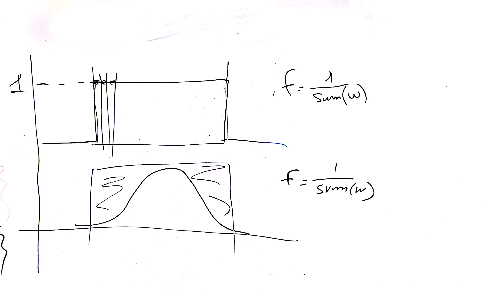
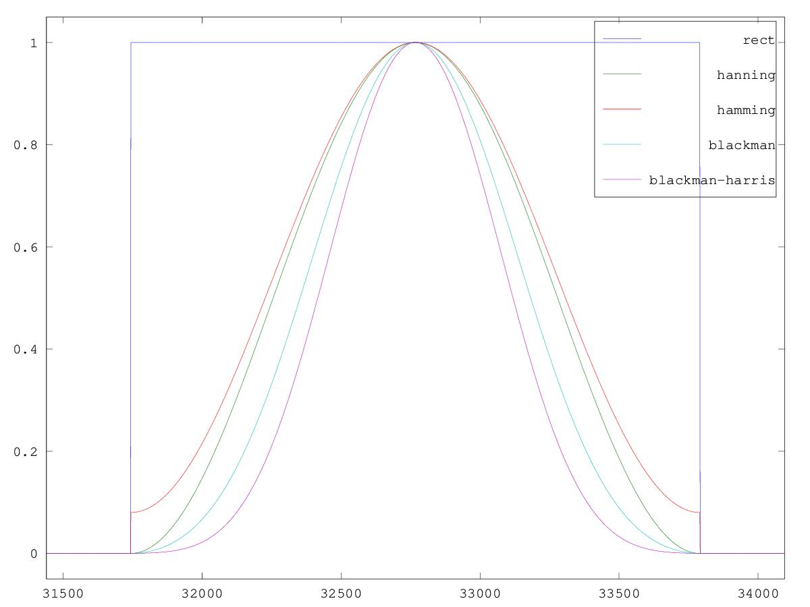
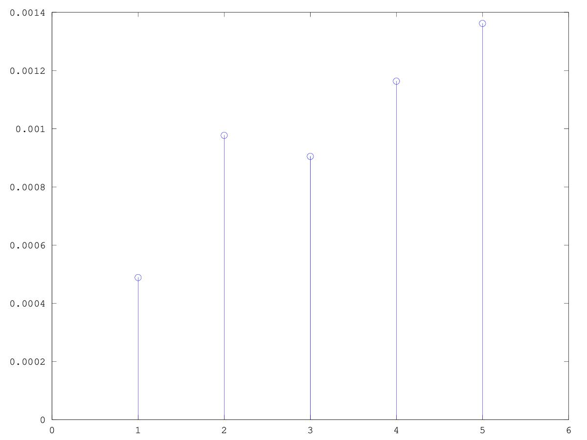

# CSEDSM II - Lezione del 19 dicembre 2018

## Argomenti

* Ricostruzione degli sms-tools con `matlab`/`octave`:
  * elucubrazioni sul rescaling delle finestre *à la Serra*

## Lavagne



## Esempi `matlab`/`octave`:

[rescaling delle finestre](./window_scaling.m)

```matlab
close all
clear all
pkg load signal

wsize = 2**11;
fftwsize = wsize*32;
zeropad = (fftwsize-wsize)/2;

boxcar = [zeros(zeropad,1); ones(wsize, 1); zeros(zeropad,1)];

hann = [zeros(zeropad, 1); hanning(wsize); zeros(zeropad, 1)];

hamm = [zeros(zeropad, 1); hamming(wsize); zeros(zeropad, 1)];

black = [zeros(zeropad, 1); blackman(wsize); zeros(zeropad, 1)];

bh = [zeros(zeropad, 1); blackmanharris(wsize); zeros(zeropad, 1)];

boxcarF = 1 / sum(boxcar);
hannF = 1 / sum(hann);
hammF = 1 / sum(hamm);
blackF = 1 / sum(black);
bhF = 1 / sum(bh);

figure (1)
leeway = 304;
x = [0:fftwsize - 1];
plot(x, boxcar, ";rect;", x, hann, ";hanning;", x, hamm,";hamming;", x, black,";blackman;", x, bh, ";blackman-harris;")
axis([zeropad-leeway fftwsize-zeropad+leeway -0.05 1.05])

figure(2)
stem([boxcarF hannF hammF blackF bhF]) 
axis([0 6])

figure(3)
boxcarFFT = 20 * log10(abs(fft(fftshift(boxcar), fftwsize)*boxcarF));
hannFFT = 20 * log10(abs(fft(fftshift(hann), fftwsize))*hannF) ;
hammFFT = 20 * log10(abs(fft(fftshift(hamm), fftwsize))*hammF) ;
blackFFT = 20 * log10(abs(fft(fftshift(black), fftwsize))*blackF);
bhFFT = 20 * log10(abs(fft(fftshift(bh), fftwsize))*bhF);

F = [-fftwsize/2: fftwsize/2 - 1];
plot(F, fftshift(boxcarFFT), ";boxcar;", F, fftshift(hannFFT), ";hanning;", F, fftshift(hammFFT), ";hamming;", F, fftshift(blackFFT), ";blackman;", F, fftshift(bhFFT), ";blackman-harris;")
axis([-512 512 -150 5])
```

Questo codice produce i seguenti grafici:





![confronto fft finestre](./confronto_fft_finestre.jpg]

