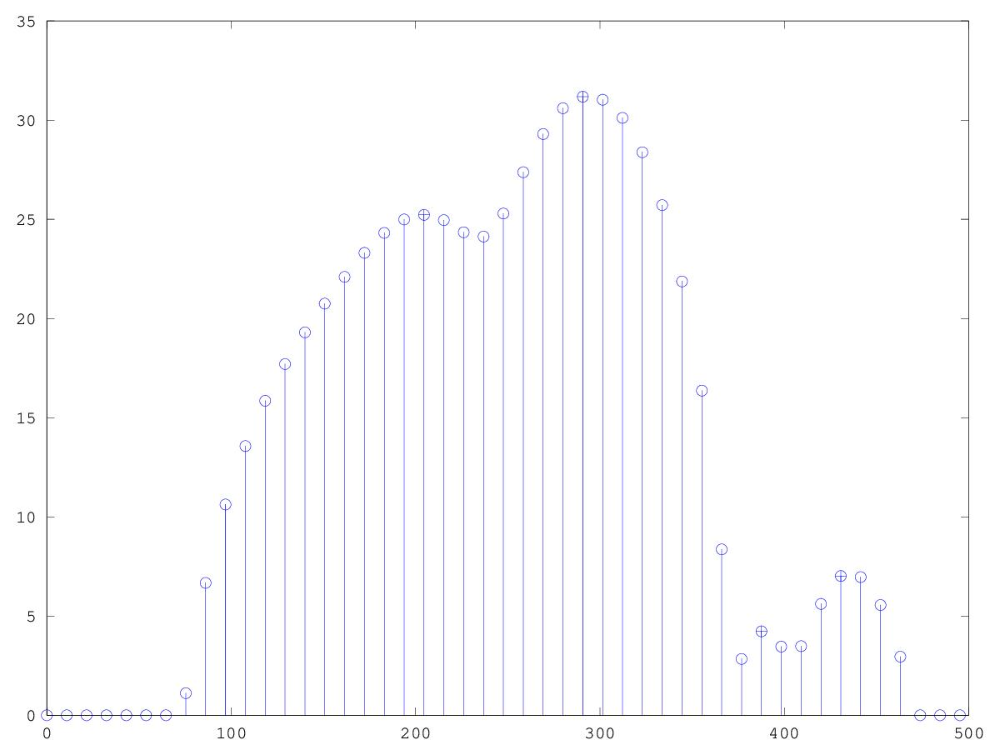

# CSEDSM II - Lezione del 6 febbraio 2019

## Argomenti

* Ricostruzione degli sms-tools con `matlab`/`octave`:
  * estrazione dei picchi spettrali (una frame)

## Esempi `octave`:

[estrazione dei picchi spettrali (una frame)](./peakD.m)

```matlab
clear all
close all

[y fs] = audioread("../sounds/cello-double.wav");
offSet = 0.5;
M = 1023;
N = 4096;
y = y(offSet * fs : (offSet * fs) + M - 1);
w = hanning(M);
s = 1/sum(w);
yW = y .* w;

fftBuffer = zeros(N, 1);
zP = ceil((N - M) / 2); 
fftBuffer(zP : zP + M - 1) = yW;

binSize = fs / N;
F = [0: binSize: fs/2 - binSize];

Y = fft(fftshift(fftBuffer));
magY = 20 *  log10(abs(Y) * s);

th = -60;

magYth = ((magY - th) .* ((magY - th) > 0)) + th;

pX = [];
nPx = 1;

for k = 1:length(F)-2
	temp = magYth(k:k+2);
	[m, idx] = max(temp);
	if idx == 2
		pX(nPx).idx = k+1;
		pX(nPx).mag = m;
		pX(nPx).freq = F(k+1);
		nPx++;
	endif
endfor

hold on

stem(F, magYth(1: N/2)-th)
plot([pX.freq], [pX.mag]-th, '+')
axis([0 500 ])
```

Questo codice produce il seguente grafico:


