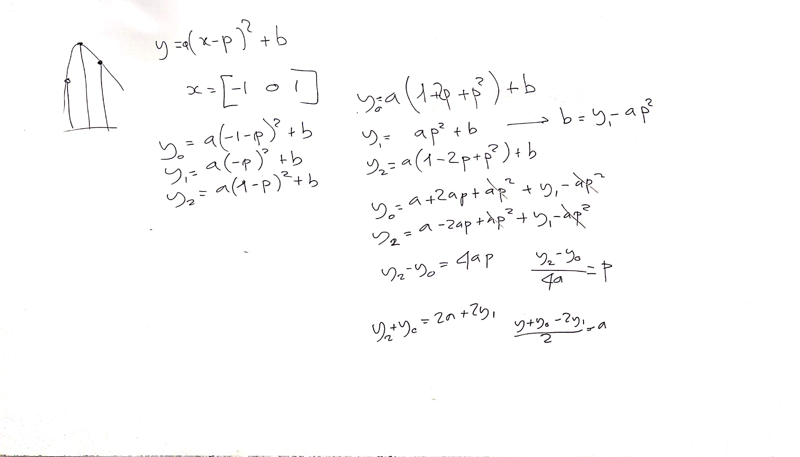
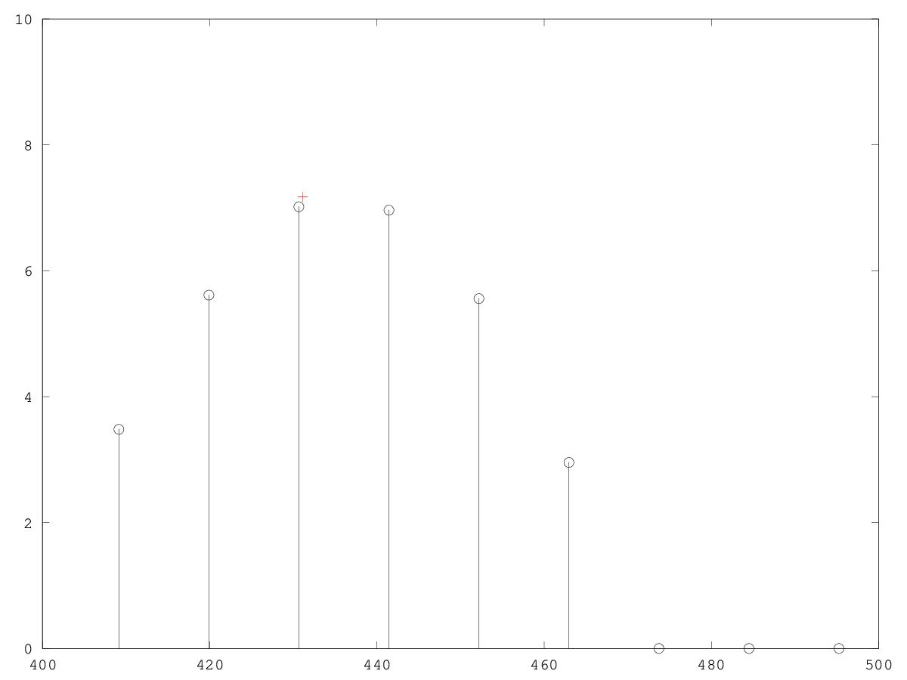
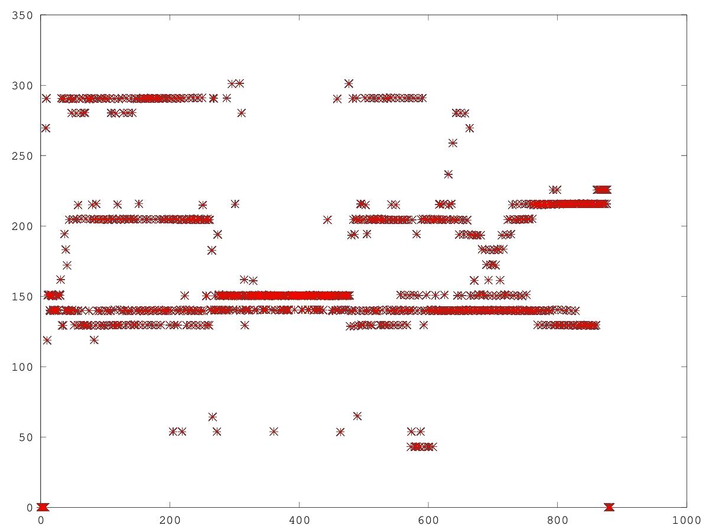

# CSEDSM II - Lezione del 20 febbraio 2019

## Argomenti

* Ricostruzione degli sms-tools con `matlab`/`octave`:
  * estrazione dei picchi spettrali (una frame)
  * interpolazione parabolica dei picchi spettrali
  * estensione alla *Short Time Fourier Transform*

## Lavagne



## Esempi `octave`:

[Funzione di interpolazione parabolica di una terna](./intparab.m)

```matlab
%Funzione che interpola 3 punti e ne restituisce magnitudine e frequenza del 
%picco massimo fra i 3 punti. 
%La funzione ritorna un array con mag e freq e riceve due array (per x e y)
%contenenti i valori dei 3 punti. 

function [freq, mag] = intparab(x,y)
  a = (y(1)+y(3)-(2*y(2)))/2;
  p = (y(1)-y(3))/(4*a);
  b = y(2)-(a*(p^2));
  
  freq = x(2)+p;
  mag = y(2)-(1/4)*(y(1)-y(3))*p;

endfunction
```

[Estrazione dei picchi spettrali con interpolazione parabolica](./peakD.m)


```matlab
clear all
close all

[y fs] = audioread("../sounds/cello-double.wav");
offSet = 0.5;
M = 1023;
N = 4096;
y = y(offSet * fs : (offSet * fs) + M - 1);
w = hanning(M);
s = 1/sum(w);
yW = y .* w;

fftBuffer = zeros(N, 1);
zP = ceil((N - M) / 2); 
fftBuffer(zP : zP + M - 1) = yW;

binSize = fs / N;
F = [0: binSize: fs/2 - binSize];

Y = fft(fftshift(fftBuffer));
magY = 20 *  log10(abs(Y) * s);

th = -60;

magYth = ((magY - th) .* ((magY - th) > 0)) + th;

pX = [];
nPx = 1;

for k = 1:length(F)-2
	temp = magYth(k:k+2);
	[m, idx] = max(temp);
	if idx == 2
		[freq, mag] = intparab(F(k:k+2), temp);
		pX(nPx).idx = k+1;
		pX(nPx).mag = mag;
		pX(nPx).freq = freq;
		nPx++;
	endif
endfor

hold on

stem(F, magYth(1: N/2)-th, 'k')
plot([pX.freq], [pX.mag]-th, '+', 'color', 'r')
axis([400 500 0 10])
```

Questo codice produce il seguente grafico:



[Funzione completa di estrazione dei picchi](./peakEx.m)

```matlab
function peaks = peakEx(x, w, N, fs)
	M = length(w);
	s = 1/sum(w);
	xW = x .* w;

	fftBuffer = zeros(N, 1);
	zP = ceil((N - M) / 2); 
	fftBuffer(zP : zP + M - 1) = xW;

	binSize = fs / N;
	F = [0: binSize: fs/2 - binSize];

	X = fft(fftshift(fftBuffer));
	magX = 20 *  log10(abs(X) * s);

	th = -60;

	magXth = ((magX - th) .* ((magX - th) > 0)) + th;

	pX = [];
	nPx = 1;

	for k = 1:length(F)-2
		temp = magXth(k:k+2);
		[m, idx] = max(temp);
		if idx == 2
			[freq, mag] = intparab(F(k:k+2), temp);
			pX(nPx).idx = k+1;
			pX(nPx).mag = mag;
			pX(nPx).freq = freq;
			nPx++;
		endif
	endfor
peaks = pX';
end
```

[Estrazione completa dei picchi spettrali](./peakStft.m)

```matlab
clear all
close all

[y fs] = audioread("../sounds/cello-double.wav");
N = 4096;
M = 1023;
H = round(M/4);

nPartial = 150;

w = hanning(M);

peakI = zeros(nPartial, ceil(length(y)/H));
peakF = zeros(nPartial, ceil(length(y)/H));
peakM = zeros(nPartial, ceil(length(y)/H));
idx = 1;
k = 1;

while (idx + M) < length(y)
	yTemp = y(idx : idx + M - 1);
	peaks = peakEx(yTemp, w, N, fs); 
	if length(peaks) == 0
		peaks = 0;
	else
		peakI(:, k) = peaks.idx;
		peakF(:, k) = peaks.freq;
		peakM(:, k) = peaks.mag;
	end
	idx += H;
	k += 1;
end

plot([0:882], peakF(:, 1:883), '*')
```

Questo codice produce il seguente grafico:


