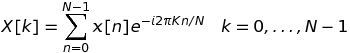
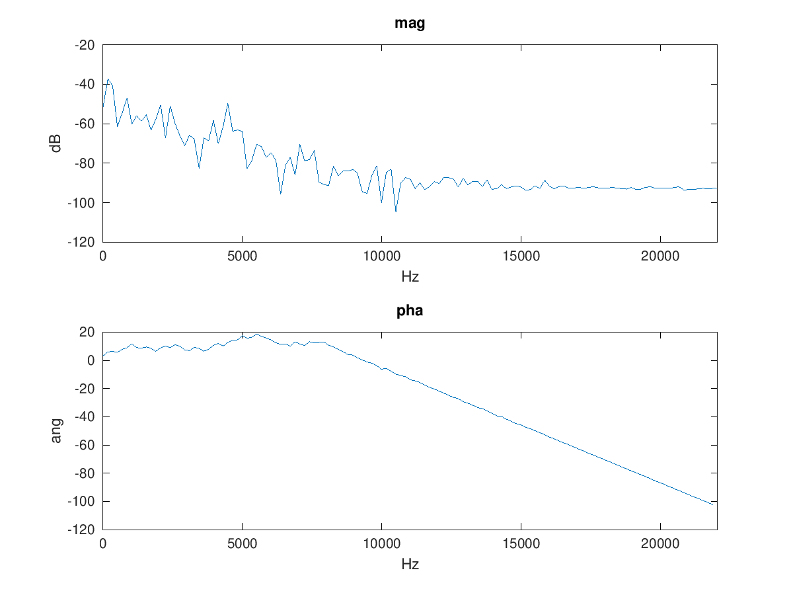

# DFT - Discrete Fourier transform
##*trasformata discreta di Fourier*

##**Equzione**

<p align="center">
  
</p>

##Dove:
* *x* è il segnale d'ingresso;
* *N* è il numero di sample nel segnale *x*. Quindi *n* è l'*n*-esimo sample di *x*;
* *X* è l'analisi risultante del segnale *x*; Quindi sarà *x* nel dominio della frequenza;
* *k* è l'indice di frequenza;
* <p align="center">
  </p> è il coniugato complesso della sinusoide a frequenza *k*;


```matlab
close all
clear all

[x, fs] = audioread('../../sounds/piano.wav');
ps = 1/fs;
dur = 0.1;			
N = dur * fs;	 
x1 = x(1:N);

T = [0:ps:dur-ps]';

K = 256;			
binSize = fs/K;			

F = [0:binSize:fs-binSize]';

for k = 1:size(F, 1)
	X(k, 1) = sum(x1.*e.^(-i*2*pi*F(k)*T));
endfor

nX = X./size(T, 1);

%magnitude
magX = 20*log10(abs(nX));

%phase
phaX = unwrap(angle(X(1:size(X, 1)/2)));

subplot(2, 1, 1)
plot(F, magX)
axis([0 fs/2])
title('mag')
xlabel('Hz')
ylabel('dB')
subplot(2, 1, 2)
plot(F(1:size(X, 1)/2), phaX)
title('pha')
axis([0 fs/2])
xlabel('Hz')
ylabel('ang')

```
<p align="center">
  
</p>


