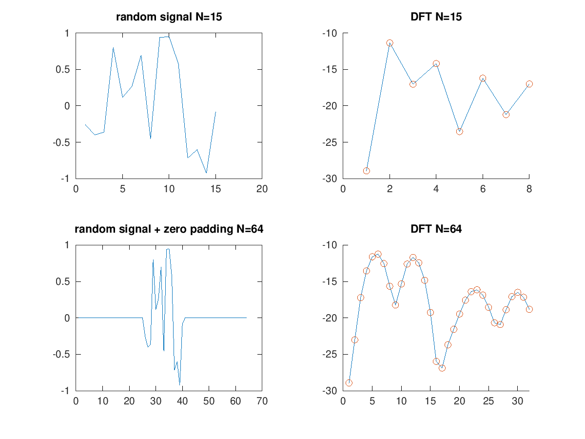

# Zero Padding, Zero Phasing, Windowing

## Zero Padding 
#### Attraverso lo **zero padding** è possibile effettuare un'interpolazione dello spettro ricavaqto dalla **DFT**.
#### Lo **zero padding** viene realizzato aggiungendo zeri all'inizio e alla fine del segnale analizzato

```matlab
close all
clear all
pkg load control

M = 15;
N = 64;

x = (rand(M, 1).*2)-1;
fftBuffer = zeros(N, 1);

%zero-padding
hN = N/2;
hM1 = floor(M/2);
hM2 = ceil(M/2);

fftBuffer(hN+1-hM1:hN) = x(1:hM1);
fftBuffer(hN+1:hN+hM2) = x(hM2:end);

X = 20*log10(abs(fft(x)/size(x,1)));
XzeroPadding = 20*log10(abs(fft(fftBuffer)/size(x,1)));

subplot(2, 2, 1)
plot(x);
title('random signal N=15')
subplot(2, 2, 2)
hold on
plot(X)
plot(X, 'o');
axis([0 hM2])
title('DFT N=15')
hold off
subplot(2, 2, 3)
plot(fftBuffer)
title('random signal + zero padding N=64')
subplot(2, 2, 4)
hold on
plot(XzeroPadding);
plot(XzeroPadding,'o');
axis([0 hN])
title('DFT N=64');
hold off
```
<p align="center">
  
</p>
