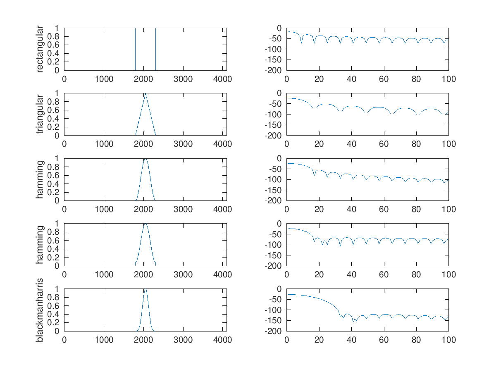

# Zero Padding, Zero Phasing, Windowing

## Zero Padding 
#### La tecnica dello *zero padding* consiste nello estendere il segnale con degli zeri, all'inizio e alla fine di questo.<br/> 
Quindi si mapperà *M* samples del nostro segnale *x* in *N > M* samples. <br/>
Attraverso questa tecnica è possibile ottenere l'interpolazione dello spettro.

```matlab
close all
clear all
pkg load control

M = 15;
N = 64;

x = (rand(M, 1).*2)-1;
fftBuffer = zeros(N, 1);

%zero-padding
hN = N/2;
hM1 = floor(M/2);
hM2 = ceil(M/2);

fftBuffer(hN+1-hM1:hN) = x(1:hM1);
fftBuffer(hN+1:hN+hM2) = x(hM2:end);

X = 20*log10(abs(fft(x)/size(x,1)));
XzeroPadding = 20*log10(abs(fft(fftBuffer)/size(x,1)));

subplot(2, 2, 1)
plot(x);
title('random signal N=15')
subplot(2, 2, 2)
hold on
plot(X)
plot(X, 'o');
axis([0 hM2])
title('DFT N=15')
hold off
subplot(2, 2, 3)
plot(fftBuffer)
title('random signal + zero padding N=64')
subplot(2, 2, 4)
hold on
plot(XzeroPadding);
plot(XzeroPadding,'o');
axis([0 hN])
title('DFT N=64');
hold off
```
<p align="center">
  
</p>

## Windowing

```matlab
clear all
close all

pkg load signal

M = 511;
N = 4096;

wind = [boxcar(M), triang(M), hanning(M), hamming(M), blackmanharris(M)];

wName = {'rectangular', 'triangular', 'hamming', 'hamming', 'blackmanharris'};

hN = N/2;
hM1 = floor(M/2);
hM2 = ceil(M/2);

analW = size(wind, 2); 

i = 1;

figure(1, 'position',[0,1000,1000,1000]);
for k = 1:analW
	fftBuffer = zeros(N, 1);
	
	fftBuffer(hN+1-hM1:hN) = wind(1:hM1, k);
	fftBuffer(hN+1:hN+hM2) = wind(hM2:end, k);

	windFFT = 20*log10(abs(fft(fftBuffer)/N));

	subplot(analW, 2, i)
	plot(fftBuffer)
	axis([0 N])
	ylabel(wName{k})
	i += 1;
	subplot(analW, 2, i)
	plot(windFFT);
	axis([0 100 -200 0])
	i += 1;
endfor
```

<p align="center">
  
</p>

## Zero Phase

```matlab
close all
clear all
pkg load control

M = 15;
N = 64;

x = (rand(M, 1).*2)-1;
fftBuffer = zeros(N, 1);

%zero-padding
hN = N/2;
hM1 = floor(M/2);
hM2 = ceil(M/2);

fftBuffer(hN+1-hM1:hN) = x(1:hM1);
fftBuffer(hN+1:hN+hM2) = x(hM2:end);

X = 20*log10(abs(fft(x)/size(x,1)));
XzeroPadding = 20*log10(abs(fft(fftBuffer)/size(x,1)));

subplot(2, 2, 1)
plot(x);
title('random signal N=15')
subplot(2, 2, 2)
hold on
plot(X)
plot(X, 'o');
axis([0 hM2])
title('DFT N=15')
hold off
subplot(2, 2, 3)
plot(fftBuffer)
title('random signal + zero padding N=64')
subplot(2, 2, 4)
hold on
plot(XzeroPadding);
plot(XzeroPadding,'o');
axis([0 hN])
title('DFT N=64');
hold off
```

<p align="center">
  
</p>

