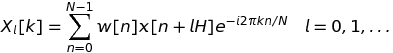
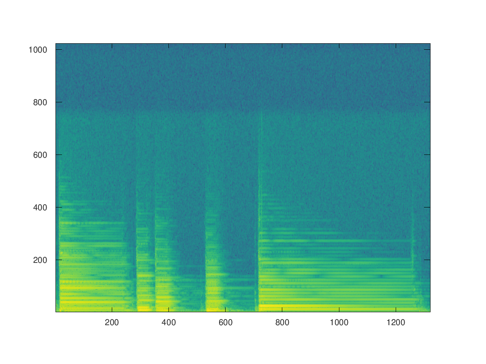

# STFT - Short Time Fourier Transform

#### La *Short Time Fourier Transform* è un potente strumento che permette di determinare l'andamento del coneuto spettrale nel tempo.<br/> 
#### **Equazione**

<p aling='center'>
	
</p>

#### Dove:
* *w* è la finestra di analisi;
* *l* è il frame analizzato;
* *H* è l'*Hopsize*	

#### In prtatica il segnale viene diviso in frame, ciascuno distanti di un *hopsize*(*H*) calcolato in sample. Ogni frame viene analizzato per mezzo della *DFT*.

```matlab
close all
clear all

pkg load signal

[x, fs] = audioread('../sounds/piano.wav');

N = 2048;
M = 511;
H = 128;

w = hanning(M);

pin = 1;
pend = size(x, 1) - M + 1;

while pin <= pend
	x1 = x(pin:pin+M-1);
	[mX, pX] = dftAnal(x1, w, N);
	
	xmagX(:, end+1) = mX;
	xphaX(:, end+1) = pX;
	
	pin += H;
endwhile

plt = pcolor(xmagX);
set(plt, 'EdgeColor', 'none');
```

<p aling='center'>
	
</p>
