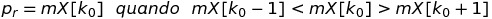
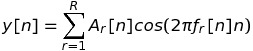
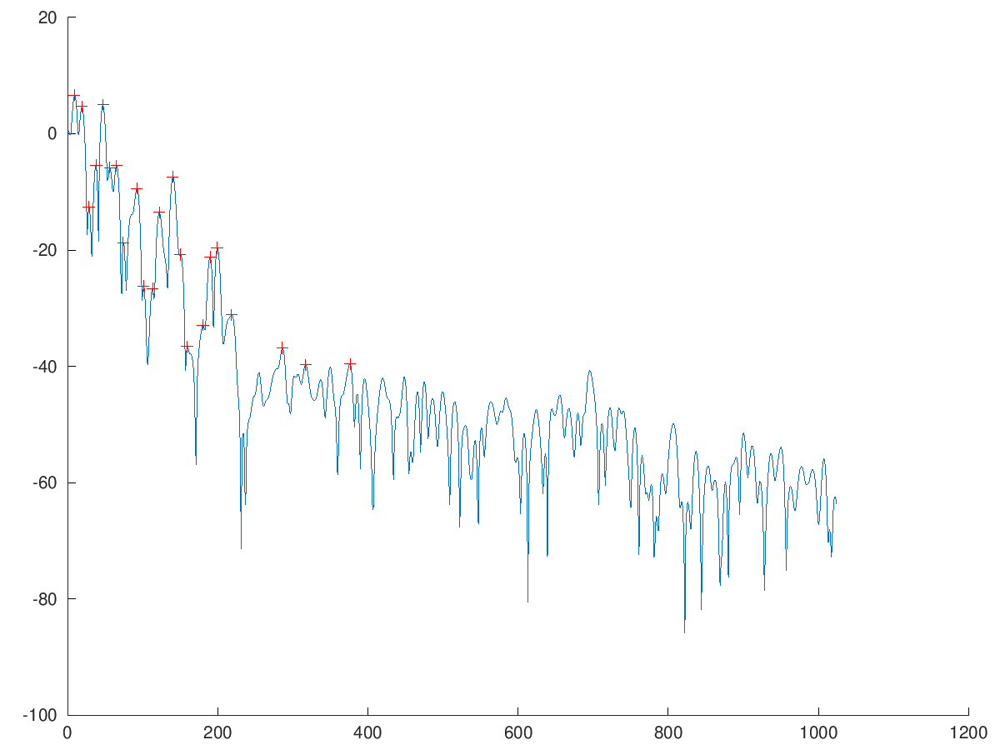

# PEAK DETECTION

#### Attraverso la *Peak Detection* è possibile localizzare i picchi nello spettro di un segnale. Vengono solitamente identificati i picchi sopra un soglia di *threshold* determinata. 

<p aling='center'>
	
</p>

### Dove:
* *mX* è lo spettro del segnale (in questo caso solo la porzione sopra una determinata threshold (*th*));
* *k<sub>0</sub>* è la posizione del picco;
* *r* è il numero del picco.
 
#### Questa tecnica viene solitamente utilizzata con il fine di ottenere le informazioni necessarie per ricostruire il segnale originale. Con la *Peak Detection* è possibile ricostruire il segnale attraverso il *modello sinusoidale* con il quale si sostituisce ogni picco con un'onda sinusoidale.

<p aling='center'>
	
</p>

```matlab
close all
clear all

pkg load signal

[x, fs] = audioread('../../sounds/piano.wav');

N = 2048;
M = 511;
w = hanning(M);
start = 1*fs;
x1 = x(start:start+M-1);
[mX, pX] = dftAnal(x1, w, N);

th = -40;

mXth = (mX - th).*((mX - th) > 0) + th;

pX = [];
nPx = 1;

i = 1;
	
while i < size(mX, 1) - 2
	[val, idx] = max(mXth(i : i+2));
	if idx == 2
		pX(nPx).idx = i + 1;
		pX(nPx).mag = val;
		nPx += 1;
	endif
	i += 1;
endwhile

figure(1)
hold on   
plot(mX);
plot([pX.idx], [pX.mag], '+', 'color', 'r');
hold off
```

<p aling='center'>
	
</p>
