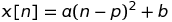
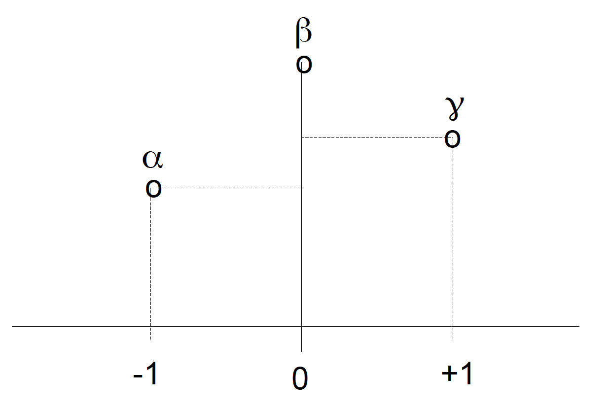
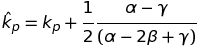
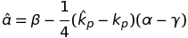
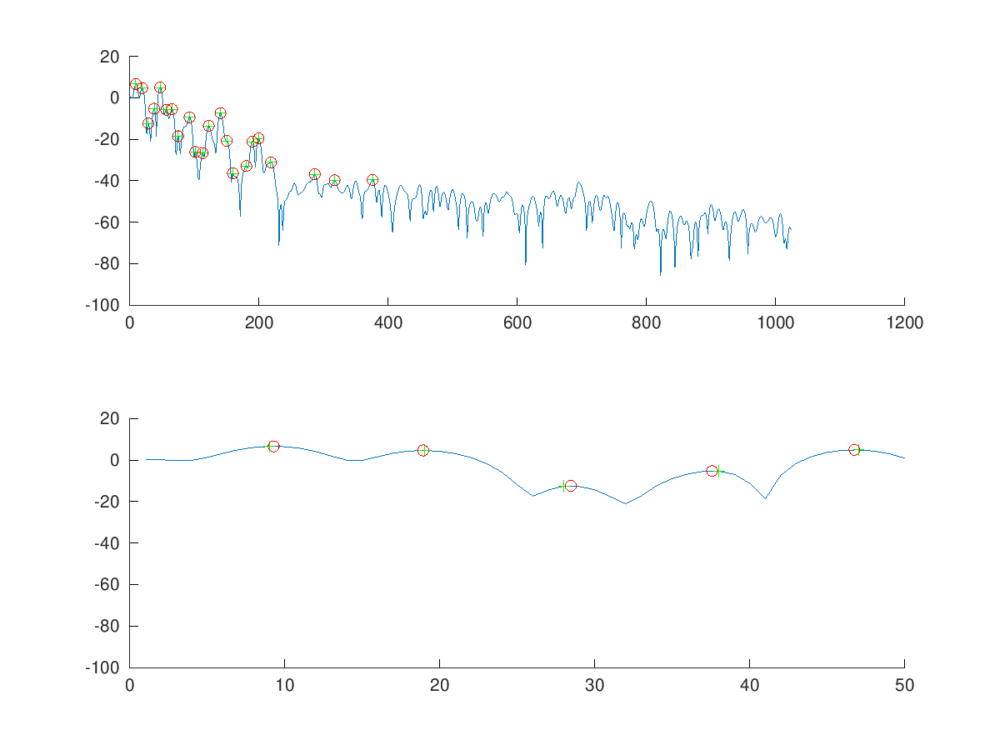

# PEAK INTERPOLATION

#### Con lo spettro ottenuto attraverso la *DFT* non è possibile estrarre la giusta posizione dei picchi (sia per quanto riguarda l'altezza che la posizione). Infatti il numero delle frequenze analizzate è uguale ad *N* (grandezza della *DFT*), pertanto si ha intervalli di frequenza di *f<sub>s</sub>/N*. Grazie allo *Zero Padding*, e quindi all'interpolazione dello spettro del segnale con l'incremento dei bin, l'accuratezza della *peak detection* aumenta. Tuttavia anche grazie a questa tecnica si ha sempre un ampio errore.</br> Per quest motivo sono state sviluppate alcune tecniche con le quali è possibile ridimensionare l'errore nella localizzazione dei picchi. </br> Una di queste è l'*interpolazione parabolica*.</br> Questa tecnica consiste nel costruire una parabola sui tre campioni più alti di un picco per trovare la vera posizione ed altezza.

#### La funzione parabola è descritta dall'equazione sottostante:

<p aling='center'>
	
</p>

#### Dove:
* *p* è il centro della parabola;
* *a* è la concavità;
* *b* è l'*offset*

#### L'*interpolazione parabolica* viene effettuata a partire dai campioni più alti del picco:
*  
*  
*  

<p aling='center'>
	
</p>

#### con i quali è possibile trovare il centro della parabola:

<p aling='center'>
	
</p>

#### e la sua altezza:

<p aling='center'>
	
</p>

```matlab
function [iploc, imag] = peakInterp(mX, ploc)
	%Peak interpolation with Parabola function
	% mX = magnitude array
	% ploc = peak location
	b = mX(ploc);
	a = mX(ploc - 1);
	y = mX(ploc + 1);

	iploc = ploc + 0.5*(a-y)/(a-2*b+y);
	imag = b - 0.25*(a-y)*(iploc-ploc);
endfunction
```
#### Per vedere l'interpolazione parabolica in un segnale si è creato il seguente codice

```matlab
close all
clear all

pkg load signal

[x, fs] = audioread('../../sounds/piano.wav');

N = 2048;
M = 511;
w = hanning(M);
start = 1*fs;
x1 = x(start:start+M-1);
[mX, pX] = dftAnal(x1, w, N);

th = -40;

mXth = (mX - th).*((mX - th) > 0) + th;

%normal peak detection

pX = [];
nPx = 1;

i = 1;
        
while i < size(mX, 1) - 2
        [val, idx] = max(mXth(i : i+2));
        if idx == 2
                pX(nPx).idx = i + 1;
                pX(nPx).mag = val;
                nPx += 1;
        endif
        i += 1;
endwhile

%peak detection with interpolation

ipX = [];
niPx = 1;

i = 1;

while i < size(mX, 1) - 2
	[val, idx] = max(mXth(i : i+2));
        if idx == 2
		[iploc, imag] = peakInterp(mX, i+1);
		ipX(niPx).iploc = iploc;
		ipX(niPx).imag = imag;
		niPx += 1;
	endif
	i += 1;
endwhile

figure(1)
subplot(2, 1, 1);
hold on
plot(mX)
plot([pX.idx], [pX.mag], '+', 'color', 'g');
plot([ipX.iploc], [ipX.imag], 'o', 'color', 'r');
hold off
subplot(2, 1, 2);
hold on
plot(mX)
plot([pX.idx], [pX.mag], '+', 'color', 'g');
plot([ipX.iploc], [ipX.imag], 'o', 'color', 'r');
axis([0 50])
hold off
```

<p aling='center'>
	
</p>
	
