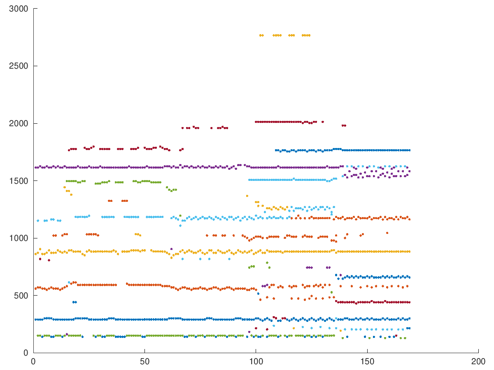

# PEAK MATCHING

#### Fino ad ora si è vista l'estrazione dei picchi per un unico frame. Se si vuole ricostruire il segnale nel tempo attraverso il *modello sinusoidale* (per il quale ogni picco estratto viene rigenerato da un onda sinusoidale), l'estrazione dei picchi deve essere effettuata per ogni frame.</br> Per questo scopo bisogna tracciare l'anadamento dei picchi e quindi accoppiarli frame dopo frame. Questo viene fatto a seconda delle posizioni di ciascun picco, sia nel tempo che nella frequenza. Pertanto se un picco ha una frequenza ravvicinata (all'interno di un range stabilito) a quello precedente (anche in questo caso la distanza temporale tra picco e picco viene scelta attraverso un grado di tolleranza), questi vengono accoppiati. Questo procedimento viene eseguito per ogni frame fino ad arrivare a tracciare diversi andamenti di picchi.</br>

```matlab
clear all
close all

[y fs] = audioread("../../sounds/cello-double.wav");
N = 4096;
M = 1023;
H = round(M/4);

rawP = peakStft(y, fs, N, M, H);

cP = [];
tol = 0.05;	%tolerance

tTol = 0.1;	%time tolerance in ms
fTol = round(tTol / (H / fs));

for n = 1: length(rawP)
	for j = 1: size(rawP(n).peaks, 1)
		check = false;
		for k = 1: length(cP)
			fCheck = cP(k).line(end, 1);
			minFC = fCheck * (1 - tol);
			maxFC = fCheck * (1 + tol);
			if rawP(n).peaks(j, 1) > minFC && rawP(n).peaks(j, 1) < maxFC
				sep = rawP(n).frame - cP(k).line(end, 3);
				if sep < fTol
					add = size(cP(k).line, 1) + 1;
					%fill in the array
					cP(k).line(add, 1) = rawP(n).peaks(j, 1);	%freq
					cP(k).line(add, 2) = rawP(n).peaks(j, 2);	%mag	
					cP(k).line(add, 3) = rawP(n).frame;		%frame
					check = true;
					break
				endif
			endif
		endfor
		if !check 
			%edit new frequency line
			newIdx = length(cP) + 1;
			cP(newIdx).line = [rawP(n).peaks(j, :), rawP(n).frame];
		endif
	endfor
endfor
```

<p aling='center'>
	
</p>

#### L'andamento delle tracce nel tempo, nell'ampiezza e nella frequenza rappresentano ugualmente l'anadametno nel tempo, nell'ampiezza e nella frequenza di ogni sinusoide che attraverso la sintesi additiva ricreano il segnale di partenza.
